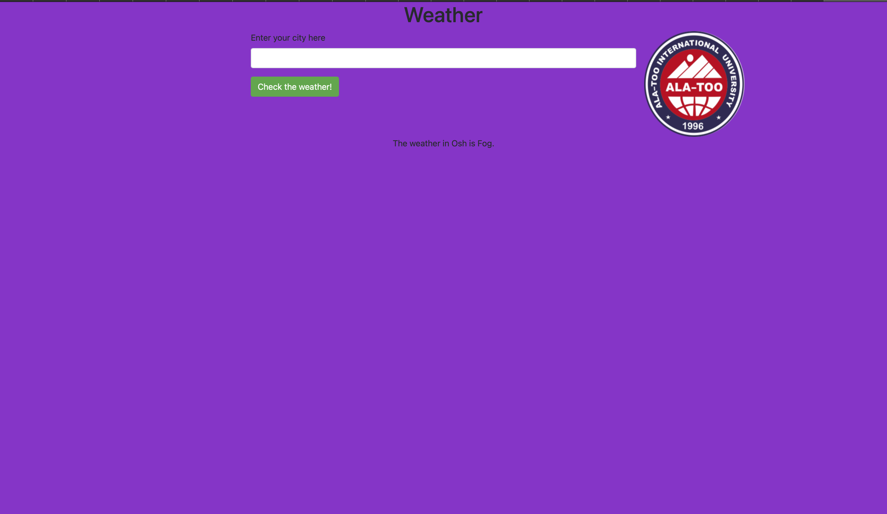

# web
My project is about forecast.A variety of widgets with information about the real situation outside the window. It is simple to use. You just enter the city then u will get weather.

Name and surname - Bakyt Ikramov Com19

Technical used - HTML,CSS,Java Script

Website link: https://bakyt-java.github.io/Ala-Too-Weatherapp/

